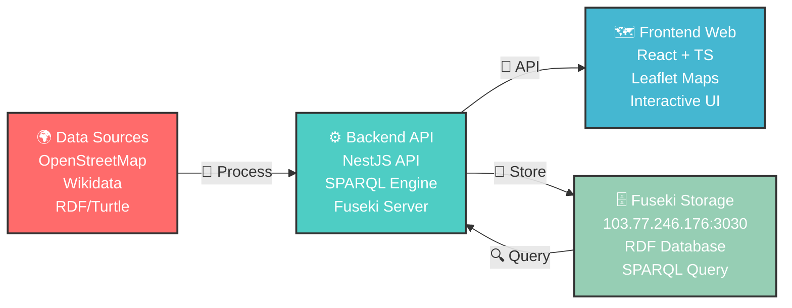

<div align="center">

# 🌍 MFitHou - Linked Open Data Platform


</div>

<div align="center">

[](https://www.gnu.org/licenses/gpl-3.0)
[](https://hou.edu.vn)
[](https://vfossa.vn/tin-tuc/gioi-thieu-chu-de-cuoc-thi-phan-mem-nguon-mo-olp-2025-746.html)

[](https://www.w3.org/DesignIssues/LinkedData.html)
[](https://www.w3.org/TR/sparql11-query/)
[](https://github.com/MFitHou)


</div>

<div align="center">

> **🚀 Open Data for Digital Transformation 🚀**
> 
> *Transforming raw data into meaningful insights through the power of Linked Open Data*

</div>

**MFitHou** là nền tảng **dữ liệu mở liên kết (Linked Open Data)** phục vụ nghiên cứu và chuyển đổi số, được phát triển để tham gia **Hackathon Phần mềm Tự do Nguồn mở** cấp **Khoa Công nghệ Thông tin - Trường Đại học Mở Hà Nội** và tương lai là **Olympic Tin học Sinh viên Việt Nam – Phần mềm nguồn mở (OLP PMNM 2025)**.

## 📋 Tổng quan dự án

Hệ thống thu thập, chuẩn hóa và trực quan hóa dữ liệu mở từ **OpenStreetMap**, **Wikidata** và các nguồn khác, cung cấp API SPARQL và giao diện bản đồ tương tác để khám phá dữ liệu địa lý.

<div align="center">

## 🏗️ Kiến trúc hệ thống


</div>



**🗄️ Lưu trữ dữ liệu**: Dữ liệu sau khi thu thập và xử lý sẽ được lưu trữ tại **Apache Jena Fuseki Server** với địa chỉ `103.77.246.176:3030/`. Hệ thống thực hiện truy xuất dữ liệu từ Fuseki thông qua SPARQL queries để hiển thị lên bản đồ tương tác.

<div align="center">

## 🔧 Các thành phần chính


</div>

<table>
<tr>
<td width="33%" align="center">

### 📥 [OpenDataFitHou](https://github.com/MFitHou/OpenDataFitHou)
**Thu thập & Xử lý dữ liệu**


🔍 **Thu thập dữ liệu**: Overpass API & Wikidata SPARQL  
📊 **Xử lý dữ liệu**: Jupyter Notebooks với Python  
🔄 **Chuyển đổi**: GeoJSON → RDF/Turtle (.ttl)  
📈 **Chuẩn hóa**: Enrichment metadata từ nhiều nguồn  

</td>
<td width="33%" align="center">

### ⚙️ [open_data_backend](https://github.com/MFitHou/open_data_backend)
**API & SPARQL Service**


🚀 **REST API**: NestJS framework với TypeScript  
🔗 **SPARQL Endpoint**: Apache Jena Fuseki  
🗄️ **Data Storage**: RDF từ Fuseki server  
🔌 **Integration**: API cầu nối cho frontend  

</td>
<td width="33%" align="center">

### 🗺️ [open_data_map](https://github.com/MFitHou/open_data_map)
**Interactive Web Map**


🎨 **Modern UI**: React 19 + TypeScript + Vite  
🗺️ **Interactive Maps**: Leaflet với OSM tiles  
🔍 **Smart Search**: Wikidata SPARQL queries  
⬇️ **Data Export**: XML và RDF/XML formats  

</td>
</tr>
</table>

<div align="center">

**🏧 ATM** • **🚌 Bus Stops** • **🏥 Hospitals** • **🏫 Schools** • **🎮 Playgrounds** • **🚻 Public Toilets** • **🚰 Drinking Water**

</div>

### ⚙️ [open_data_backend](https://github.com/MFitHou/open_data_backend) - API & SPARQL Service
- 🚀 **REST API**: NestJS framework với TypeScript
- 🔗 **SPARQL Endpoint**: Tích hợp Apache Jena Fuseki tại `103.77.246.176:3030/`
- 🗄️ **Data Storage**: Lưu trữ và truy xuất dữ liệu RDF từ Fuseki server
- 🌐 **Data Management**: Quản lý và phục vụ dữ liệu RDF cho frontend
- 🔌 **Integration**: Cung cấp API cầu nối giữa Fuseki và ứng dụng bản đồ

### 🗺️ [open_data_map](https://github.com/MFitHou/open_data_map) - Interactive Web Map
- 🎨 **Modern UI**: React 19 + TypeScript + Vite
- 🗺️ **Interactive Maps**: Leaflet với OpenStreetMap tiles  
- 🔍 **Smart Search**: Tích hợp Wikidata với SPARQL queries
- 📍 **Nearby Services**: Tìm kiếm dịch vụ lân cận (ATM, bệnh viện, etc.)
- ⬇️ **Data Export**: Xuất dữ liệu dạng XML và RDF/XML

<div align="center">

## ✨ Tính năng nổi bật


</div>

<div align="center">
<table>
<tr>
<td align="center" width="50%">

### 🔍 Tìm kiếm thông minh


**SPARQL & Wikidata Integration**  
Tích hợp AI-powered search với độ chính xác cao

---

### 📍 Dịch vụ lân cận  


**Smart Location Services**  
Tìm ATM, bệnh viện, trạm xe bus gần bạn trong thời gian thực

---

### 🌐 RESTful API


**Developer-Friendly**  
SPARQL endpoint mạnh mẽ cho developers

</td>
<td align="center" width="50%">

### 🗺️ Bản đồ tương tác


**Interactive Mapping**  
Auto-highlighting và real-time focus

---

### ⬇️ Export dữ liệu


**Multi-format Export**  
XML và RDF/XML tuân theo chuẩn Linked Data

---

### 📱 Responsive Design


**Cross-Platform**  
Tương thích hoàn hảo mobile và desktop

</td>
</tr>
</table>
</div>

## 🚀 Quick Start

### 1️⃣ Clone tất cả repositories
```bash
# Data processing
git clone https://github.com/MFitHou/OpenDataFitHou.git

# Backend API
git clone https://github.com/MFitHou/open_data_backend.git

# Frontend Map
git clone https://github.com/MFitHou/open_data_map.git
```

### 2️⃣ Chạy Backend (NestJS + Fuseki)
```bash
cd open_data_backend
npm install
npm run start:dev
# Server chạy tại: http://localhost:3000
# Kết nối với Fuseki server: 103.77.246.176:3030/
```

### 3️⃣ Chạy Frontend (React + Vite)
```bash
cd open_data_map  
npm install
npm run dev
# Web app chạy tại: http://localhost:5173
```

### 4️⃣ Xử lý dữ liệu (Python Notebooks)
```bash
cd OpenDataFitHou
pip install -r requirements.txt
jupyter notebook
# Mở OverpassApi.ipynb và ParseRDF.ipynb
```

## 🎯 Mục tiêu dự án

- 🌍 **Open Data Ecosystem**: Thu thập và chuẩn hóa dữ liệu mở từ nhiều nguồn
- 🔗 **Linked Open Data**: Xây dựng hệ thống LOD giúp tích hợp và tái sử dụng dễ dàng  
- 📊 **Data Visualization**: Trực quan hóa dữ liệu địa lý trên bản đồ tương tác
- 🚀 **Digital Transformation**: Hỗ trợ nghiên cứu và ứng dụng chuyển đổi số
- 🎓 **Education**: Phục vụ học tập và nghiên cứu về Semantic Web

## �️ Tech Stack

### Data Processing
- 🐍 **Python**: rdflib, geopandas, pandas, requests
- 📓 **Jupyter**: Interactive data processing notebooks
- 🌐 **APIs**: Overpass API, Wikidata SPARQL Service

### Backend
- 🚀 **NestJS**: Modern Node.js framework
- 📊 **Apache Jena Fuseki**: RDF database và SPARQL endpoint (`103.77.246.176:3030/`)
- 🔍 **SPARQL**: Query language cho RDF data từ Fuseki server
- 📡 **REST API**: Chuẩn RESTful cho data access và integration

### Frontend  
- ⚛️ **React 19**: Latest React với TypeScript
- ⚡ **Vite**: Fast build tool với HMR
- 🗺️ **Leaflet**: Interactive maps library
- 🎨 **Modern CSS**: Responsive và accessible UI

## 📊 Dữ liệu

### Nguồn dữ liệu
| Nguồn | Mục đích | Format | Lưu trữ |
|-------|----------|---------|---------|
| 🌍 **OpenStreetMap** | Dữ liệu địa lý, POI | GeoJSON → RDF | Fuseki Server |
| 🔗 **Wikidata** | Metadata, identifiers | SPARQL → RDF | Fuseki Server |
| 📊 **Linked Data** | Semantic relationships | RDF/Turtle | `103.77.246.176:3030/` |

### Quy trình dữ liệu
```
Thu thập (OSM/Wikidata) → Xử lý (Python) → RDF/Turtle → Fuseki (103.77.246.176:3030/) → API → Bản đồ
```

### Loại dữ liệu hiện có
- 🏧 **ATM** - Máy rút tiền tự động
- 🚌 **Bus Stops** - Trạm xe buýt  
- 🏥 **Hospitals** - Bệnh viện và phòng khám
- 🏫 **Schools** - Trường học các cấp
- 🚻 **Public Toilets** - Nhà vệ sinh công cộng
- 🚰 **Drinking Water** - Điểm nước uống
- 🎮 **Playgrounds** - Sân chơi trẻ em

<div align="center">

## 👥 Đội ngũ phát triển


**Dự án được phát triển bởi đội ngũ sinh viên đam mê công nghệ và dữ liệu mở**

</div>

<div align="center">
<table>
<tr>
<td align="center" width="33%">


### 👨‍💻 **Vũ Hoàng Anh**
**� Data Engineer**


⚙️ Fuseki Server Management  
🔧 API Design & Integration  
� Data Processing & ETL  


</td>
<td align="center" width="33%">


### �‍💻 **Nguyễn Hồng Ánh**  
**🎨 Frontend Developer**


🗺️ Interactive Map Features  
✨ Modern Web Development  
🎨 UI/UX Design Specialist  


</td>
<td align="center" width="33%">


### 👨‍💻 **Tống Tâm Xuân**
**🚀 Backend Architect**


🔍 SPARQL Query Optimization  
🏗️ System Architecture  
⚡ Performance Optimization  


</td>
</tr>
</table>
</div>

<div align="center">


> *"🚀 Khi đam mê công nghệ kết hợp với tinh thần open source,  
> chúng ta tạo ra những giá trị tuyệt vời cho cộng đồng! 🌟"*

</div>

## 🤝 Đóng góp

Chúng tôi hoan nghênh mọi đóng góp! Xem [CONTRIBUTING.md](CONTRIBUTING.md) để biết chi tiết.

### Cách đóng góp:
1. 🍴 Fork repository bạn muốn đóng góp
2. 🔧 Tạo feature branch (`git checkout -b feature/amazing-feature`)
3. ✅ Commit changes (`git commit -m 'Add amazing feature'`)
4. 📤 Push to branch (`git push origin feature/amazing-feature`)  
5. 🔄 Tạo Pull Request

## 📄 License

Dự án này được phân phối dưới [GNU General Public License v3.0](LICENSE). Xem `LICENSE` để biết chi tiết.

## 🏆 Cuộc thi & Mục tiêu

**Trước mắt**: Dự án được phát triển để tham gia **Hackathon Phần mềm Tự do Nguồn mở** cấp **Khoa Công nghệ Thông tin - Trường Đại học Mở Hà Nội**.

**Dài hạn**: Hướng tới tham gia **Olympic Tin học Sinh viên Việt Nam – Phần mềm nguồn mở (OLP PMNM 2025)**.

<div align="center">


</div>

<div align="center">

## 🎯 Hãy ủng hộ dự án của chúng tôi!


**⭐ Nếu dự án hữu ích, hãy cho chúng tôi một star! ⭐**

<a href="https://mfithou.github.io/open_data_map">
  
</a>
<a href="https://github.com/MFitHou/OpenDataFitHou/wiki">
  
</a>
<a href="https://github.com/MFitHou/OpenDataFitHou/issues">
  
</a>
<a href="https://github.com/MFitHou/OpenDataFitHou/discussions">
  
</a>

---


</div>  
