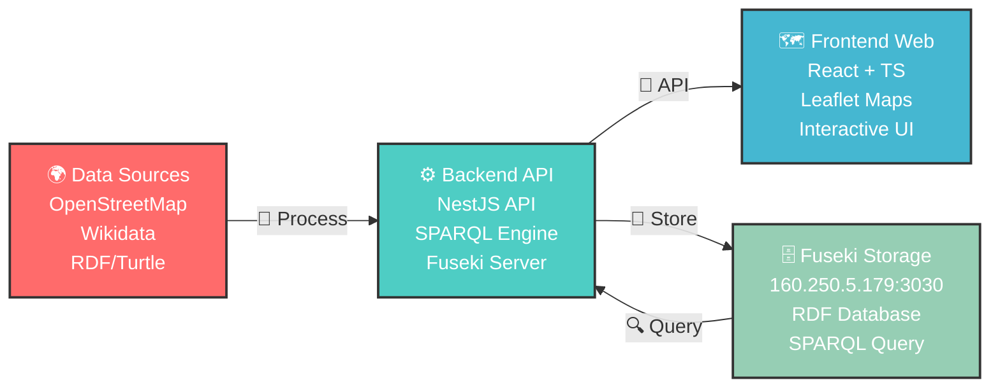

# OpenDataMap - Open Urban Utility Map Platform

[](https://www.gnu.org/licenses/gpl-3.0)
[](https://www.w3.org/DesignIssues/LinkedData.html)
[](https://www.w3.org/TR/sparql11-query/)

**Languages / Ngôn ngữ:** 
[English](README.md) | [Tiếng Việt](README.vi.md)

---

## Overview

OpenDataMap is a Linked Open Data (LOD) platform designed for research and digital transformation. The system collects, standardizes, and visualizes open data from OpenStreetMap and Wikidata, providing SPARQL API endpoints and interactive map interfaces for geographic data exploration.

This project was developed by **MFitHou team** to participate in the Vietnam Student Informatics Olympics - Open Source Software (OLP PMNM 2025) at HUTECH.

## System Architecture


```mermaid
graph LR
    A[🌍 Data Sources<br/>OpenStreetMap<br/>Wikidata<br/>RDF/Turtle] 
    B[⚙️ Backend API<br/>NestJS API<br/>SPARQL Engine<br/>Fuseki Server]
    C[🗺️ Frontend Web<br/>React + TS<br/>Leaflet Maps<br/>Interactive UI]
    D[🗄️ Fuseki Storage<br/>160.250.5.179:3030<br/>RDF Database<br/>SPARQL Query]
    
    A -->|🔄 Process| B
    B -->|📡 API| C
    B -->|💾 Store| D
    D -->|🔍 Query| B
    
    style A fill:#FF6B6B,stroke:#333,stroke-width:2px,color:#fff
    style B fill:#4ECDC4,stroke:#333,stroke-width:2px,color:#fff
    style C fill:#45B7D1,stroke:#333,stroke-width:2px,color:#fff
    style D fill:#96CEB4,stroke:#333,stroke-width:2px,color:#fff
```

Data collected and processed is stored in an Apache Jena Fuseki Server at `160.250.5.179:3030/`. The system retrieves data from Fuseki via SPARQL queries to display on the interactive map.

## Project Components

### 1. [OpenDataFitHou](https://github.com/MFitHou/OpenDataFitHou) - Data Collection & Processing
- Data collection from Overpass API and Wikidata SPARQL endpoints
- Data processing using Jupyter Notebooks with Python
- Conversion from GeoJSON to RDF/Turtle format
- Metadata enrichment and standardization

**Technologies:** Python, Jupyter, rdflib, geopandas, pandas

### 2. [open_data_backend](https://github.com/MFitHou/open_data_backend) - API & SPARQL Service
- RESTful API built with NestJS framework and TypeScript
- Integration with Apache Jena Fuseki at `160.250.5.179:3030/`
- RDF data storage and retrieval from Fuseki server
- Data management and API bridge between Fuseki and frontend applications

**Technologies:** NestJS, Node.js, TypeScript, Apache Jena Fuseki

### 3. [open_data_map](https://github.com/MFitHou/open_data_map) - Interactive Web Map
- Modern UI built with React 19, TypeScript, and Vite
- Interactive maps using Leaflet with OpenStreetMap tiles
- Wikidata integration with SPARQL queries for smart search
- Nearby services search (ATMs, hospitals, bus stops, etc.)
- Data export functionality in XML and RDF/XML formats

**Technologies:** React 19, TypeScript, Vite, Leaflet, React-Leaflet

## Key Features

### SPARQL Query Interface
Execute custom SPARQL queries against the RDF dataset to retrieve specific information about urban utilities and points of interest.

### Intelligent Search
Integration with Wikidata SPARQL endpoints for enhanced search capabilities with high accuracy.

### Nearby Services
Real-time location-based search for nearby amenities including ATMs, hospitals, bus stops, schools, playgrounds, public toilets, and drinking water sources.

### Interactive Mapping
Dynamic map interface with auto-highlighting and real-time focus capabilities for better user experience.

### Data Export
Export data in multiple formats (XML, RDF/XML) following Linked Data standards for interoperability.

### Supported Data Types
- ATMs (Automated Teller Machines)
- Bus Stops
- Hospitals and Clinics
- Schools (all levels)
- Public Toilets
- Drinking Water Points
- Playgrounds

## Getting Started

### Prerequisites
- Node.js v18 or higher
- Python 3.8+
- Git

### Installation

#### 1. Clone All Repositories
```bash
# Data processing repository
git clone https://github.com/MFitHou/OpenDataFitHou.git

# Backend API repository
git clone https://github.com/MFitHou/open_data_backend.git

# Frontend map repository
git clone https://github.com/MFitHou/open_data_map.git
```

#### 2. Setup Backend (NestJS + Fuseki)
```bash
cd open_data_backend
npm install
npm run start:dev
# Server runs at: http://localhost:3000
# Connected to Fuseki server: 160.250.5.179:3030/
```

#### 3. Setup Frontend (React + Vite)
```bash
cd open_data_map
npm install
npm run dev
# Web application runs at: http://localhost:5173
```

#### 4. Data Processing (Python Notebooks)
```bash
cd OpenDataFitHou
pip install -r requirements.txt
jupyter notebook
# Open OverpassApi.ipynb and ParseRDF.ipynb
```

## Project Goals

- **Open Data Ecosystem**: Collect and standardize open data from multiple sources
- **Linked Open Data**: Build LOD-compliant systems for easy integration and reuse
- **Data Visualization**: Visualize geographic data on interactive maps
- **Digital Transformation**: Support research and applications in digital transformation
- **Education**: Serve as a learning resource for Semantic Web technologies

## Technology Stack

### Data Processing Layer
- **Python 3.8+**: rdflib, geopandas, pandas, requests
- **Jupyter Notebooks**: Interactive data exploration and processing
- **APIs**: Overpass API (OpenStreetMap), Wikidata SPARQL Service

### Backend Layer
- **NestJS**: Modern Node.js framework with TypeScript
- **Apache Jena Fuseki**: RDF database and SPARQL endpoint (`160.250.5.179:3030/`)
- **SPARQL 1.1**: Query language for RDF data
- **RESTful API**: Standard REST principles for data access

### Frontend Layer
- **React 19**: Modern React framework with TypeScript
- **Vite**: Fast build tool with Hot Module Replacement (HMR)
- **Leaflet**: Open-source interactive mapping library
- **Responsive CSS**: Cross-device compatibility

## Data Sources and Workflow

### Data Sources
| Source | Purpose | Format | Storage |
|--------|---------|--------|---------|
| OpenStreetMap | Geographic data, Points of Interest | GeoJSON → RDF | Fuseki Server |
| Wikidata | Metadata, entity identifiers | SPARQL → RDF | Fuseki Server |
| Linked Data | Semantic relationships | RDF/Turtle | `160.250.5.179:3030/` |

### Data Processing Workflow
```
Collection (OSM/Wikidata) → Processing (Python) → RDF/Turtle → Fuseki (160.250.5.179:3030/) → REST API → Web Map
```

The workflow consists of:
1. **Collection**: Retrieve data from OpenStreetMap (Overpass API) and Wikidata (SPARQL endpoints)
2. **Processing**: Transform and enrich data using Python scripts in Jupyter Notebooks
3. **Conversion**: Convert GeoJSON to RDF/Turtle format following Linked Data principles
4. **Storage**: Upload RDF data to Apache Jena Fuseki server at `160.250.5.179:3030/`
5. **API Layer**: NestJS backend provides RESTful API and SPARQL query interface
6. **Visualization**: React frontend displays data on interactive Leaflet maps

### Available Data Types
- **ATMs**: Automated Teller Machines
- **Bus Stops**: Public transportation stops
- **Hospitals**: Medical facilities and clinics
- **Schools**: Educational institutions (all levels)
- **Public Toilets**: Public restroom facilities
- **Drinking Water**: Public drinking water points
- **Playgrounds**: Children's play areas

## Development Team

| Name | Role | Responsibilities | GitHub |
|------|------|------------------|--------|
| **Vũ Hoàng Anh** | Data Engineer | Fuseki Server Management, API Design & Integration, Data Processing & ETL | [@VuHoangAnh2110](https://github.com/VuHoangAnh2110) |
| **Nguyễn Hồng Ánh** | Frontend Developer | Interactive Map Features, Modern Web Development, UI/UX Design | [@honganhss](https://github.com/honganhss) |
| **Tống Tâm Xuân** | Backend Architect | SPARQL Query Optimization, System Architecture, Performance Optimization | [@VNgKhanh04](https://github.com/VNgKhanh04) |

## Competition Participation

**Current**: This project is being developed to participate in the Vietnam Student Informatics Olympics - Open Source Software (OLP PMNM 2025).

**Future**: This project aims to make positive contributions to the community, people, businesses, and developers.

## Contributing

We welcome contributions to OpenDataMap! Please feel free to submit issues, fork the repository, and send pull requests.

### How to Contribute
1. Fork the repository
2. Create your feature branch (`git checkout -b feature/AmazingFeature`)
3. Commit your changes (`git commit -m 'Add some AmazingFeature'`)
4. Push to the branch (`git push origin feature/AmazingFeature`)
5. Open a Pull Request

## Links

- **Live Demo**: [https://opendatamap.hou.edu.vn/](https://opendatamap.hou.edu.vn/)
- **Documentation**: [https://mfithou.github.io/MFitHou-Documents/](https://mfithou.github.io/MFitHou-Documents/)
- **Issue Tracker**: [GitHub Issues](https://github.com/MFitHou/OpenDataFitHou/issues)
- **Discussions**: [GitHub Discussions](https://github.com/MFitHou/OpenDataFitHou/discussions)

## License

This project is licensed under the GNU General Public License v3.0 - see the [LICENSE](LICENSE) file for details.

## Contact

For questions or support, please open an issue on GitHub or contact the development team through the repository.

---

**OpenDataMap** - Open Urban Utility Map Platform  
Developed by **MFitHou Team**  
Faculty of Information Technology, Hanoi Open University  
