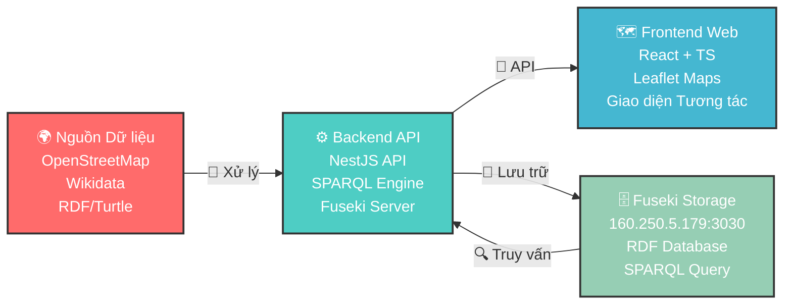

# OpenDataMap - Nền Tảng Bản Đồ Tiện Ích Đô Thị Mở

[](https://www.gnu.org/licenses/gpl-3.0)
[](https://www.w3.org/DesignIssues/LinkedData.html)
[](https://www.w3.org/TR/sparql11-query/)

**Languages / Ngôn ngữ:** 
[English](README.md) | [Tiếng Việt](README.vi.md)

---

## Tổng quan

OpenDataMap là nền tảng dữ liệu mở liên kết (LOD - Linked Open Data) được thiết kế cho nghiên cứu và chuyển đổi số. Hệ thống thu thập, chuẩn hóa và trực quan hóa dữ liệu mở từ OpenStreetMap và Wikidata, cung cấp API SPARQL và giao diện bản đồ tương tác để khám phá dữ liệu địa lý.

Dự án được phát triển bởi **nhóm MFitHou** để tham gia Olympic Tin học Sinh viên Việt Nam - Phần mềm Nguồn mở (OLP PMNM 2025) tại HUTECH.

## Kiến trúc Hệ thống



Dữ liệu sau khi thu thập và xử lý được lưu trữ tại Apache Jena Fuseki Server với địa chỉ `160.250.5.179:3030/`. Hệ thống truy xuất dữ liệu từ Fuseki thông qua truy vấn SPARQL để hiển thị trên bản đồ tương tác.

## Các Thành Phần Dự Án

### 1. [OpenDataFitHou](https://github.com/MFitHou/OpenDataFitHou) - Thu thập & Xử lý Dữ liệu
- Thu thập dữ liệu từ Overpass API và Wikidata SPARQL endpoints
- Xử lý dữ liệu sử dụng Jupyter Notebooks với Python
- Chuyển đổi từ GeoJSON sang định dạng RDF/Turtle
- Làm giàu và chuẩn hóa metadata

**Công nghệ:** Python, Jupyter, rdflib, geopandas, pandas

### 2. [open_data_backend](https://github.com/MFitHou/open_data_backend) - API & Dịch vụ SPARQL
- RESTful API được xây dựng với NestJS framework và TypeScript
- Tích hợp với Apache Jena Fuseki tại `160.250.5.179:3030/`
- Lưu trữ và truy xuất dữ liệu RDF từ Fuseki server
- Quản lý dữ liệu và cầu nối API giữa Fuseki và ứng dụng frontend

**Công nghệ:** NestJS, Node.js, TypeScript, Apache Jena Fuseki

### 3. [open_data_map](https://github.com/MFitHou/open_data_map) - Bản Đồ Web Tương Tác
- Giao diện hiện đại được xây dựng với React 19, TypeScript và Vite
- Bản đồ tương tác sử dụng Leaflet với OpenStreetMap tiles
- Tích hợp Wikidata với truy vấn SPARQL cho tìm kiếm thông minh
- Tìm kiếm dịch vụ lân cận (ATM, bệnh viện, trạm xe buýt, v.v.)
- Chức năng xuất dữ liệu ở định dạng XML và RDF/XML

**Công nghệ:** React 19, TypeScript, Vite, Leaflet, React-Leaflet

## Tính Năng Chính

### Giao diện Truy vấn SPARQL
Thực thi các truy vấn SPARQL tùy chỉnh đối với tập dữ liệu RDF để lấy thông tin cụ thể về tiện ích đô thị và điểm quan tâm.

### Tìm kiếm Thông minh
Tích hợp với Wikidata SPARQL endpoints để tăng cường khả năng tìm kiếm với độ chính xác cao.

### Dịch vụ Lân cận
Tìm kiếm theo vị trí thời gian thực cho các tiện ích gần bạn bao gồm ATM, bệnh viện, trạm xe buýt, trường học, sân chơi, nhà vệ sinh công cộng và điểm nước uống.

### Bản Đồ Tương Tác
Giao diện bản đồ động với khả năng tự động làm nổi bật và tập trung thời gian thực để có trải nghiệm người dùng tốt hơn.

### Xuất Dữ liệu
Xuất dữ liệu ở nhiều định dạng (XML, RDF/XML) tuân theo tiêu chuẩn Linked Data để đảm bảo khả năng tương tác.

### Các Loại Dữ liệu Được Hỗ trợ
- ATM (Máy Rút Tiền Tự động)
- Trạm Xe Buýt
- Bệnh viện và Phòng khám
- Trường Học (tất cả cấp)
- Nhà Vệ sinh Công cộng
- Điểm Nước Uống
- Sân Chơi

## Bắt Đầu

### Yêu Cầu
- Node.js phiên bản 18 trở lên
- Python 3.8+
- Git

### Cài Đặt

#### 1. Clone Tất Cả Repositories
```bash
# Repository xử lý dữ liệu
git clone https://github.com/MFitHou/OpenDataFitHou.git

# Repository Backend API
git clone https://github.com/MFitHou/open_data_backend.git

# Repository Frontend map
git clone https://github.com/MFitHou/open_data_map.git
```

#### 2. Cài Đặt Backend (NestJS + Fuseki)
```bash
cd open_data_backend
npm install
npm run start:dev
# Server chạy tại: http://localhost:3000
# Kết nối với Fuseki server: 160.250.5.179:3030/
```

#### 3. Cài Đặt Frontend (React + Vite)
```bash
cd open_data_map
npm install
npm run dev
# Ứng dụng web chạy tại: http://localhost:5173
```

#### 4. Xử Lý Dữ liệu (Python Notebooks)
```bash
cd OpenDataFitHou
pip install -r requirements.txt
jupyter notebook
# Mở OverpassApi.ipynb và ParseRDF.ipynb
```

## Mục Tiêu Dự Án

- **Hệ sinh thái Dữ liệu Mở**: Thu thập và chuẩn hóa dữ liệu mở từ nhiều nguồn
- **Linked Open Data**: Xây dựng hệ thống tuân thủ LOD để dễ dàng tích hợp và tái sử dụng
- **Trực quan hóa Dữ liệu**: Trực quan hóa dữ liệu địa lý trên bản đồ tương tác
- **Chuyển đổi Số**: Hỗ trợ nghiên cứu và ứng dụng trong chuyển đổi số
- **Giáo dục**: Phục vụ như tài nguyên học tập cho công nghệ Semantic Web

## Ngăn Xếp Công Nghệ

### Lớp Xử lý Dữ liệu
- **Python 3.8+**: rdflib, geopandas, pandas, requests
- **Jupyter Notebooks**: Khám phá và xử lý dữ liệu tương tác
- **APIs**: Overpass API (OpenStreetMap), Wikidata SPARQL Service

### Lớp Backend
- **NestJS**: Framework Node.js hiện đại với TypeScript
- **Apache Jena Fuseki**: Cơ sở dữ liệu RDF và SPARQL endpoint (`160.250.5.179:3030/`)
- **SPARQL 1.1**: Ngôn ngữ truy vấn cho dữ liệu RDF
- **RESTful API**: Tuân thủ nguyên tắc REST chuẩn cho truy cập dữ liệu

### Lớp Frontend
- **React 19**: Framework React hiện đại với TypeScript
- **Vite**: Công cụ build nhanh với Hot Module Replacement (HMR)
- **Leaflet**: Thư viện bản đồ tương tác mã nguồn mở
- **Responsive CSS**: Tương thích đa thiết bị

## Nguồn Dữ liệu và Quy trình

### Nguồn Dữ liệu
| Nguồn | Mục đích | Định dạng | Lưu trữ |
|-------|----------|-----------|---------|
| OpenStreetMap | Dữ liệu địa lý, Điểm quan tâm | GeoJSON → RDF | Fuseki Server |
| Wikidata | Metadata, định danh thực thể | SPARQL → RDF | Fuseki Server |
| Linked Data | Quan hệ ngữ nghĩa | RDF/Turtle | `160.250.5.179:3030/` |

### Quy Trình Xử Lý Dữ liệu
```
Thu thập (OSM/Wikidata) → Xử lý (Python) → RDF/Turtle → Fuseki (160.250.5.179:3030/) → REST API → Bản Đồ Web
```

Quy trình bao gồm:
1. **Thu thập**: Lấy dữ liệu từ OpenStreetMap (Overpass API) và Wikidata (SPARQL endpoints)
2. **Xử lý**: Chuyển đổi và làm giàu dữ liệu sử dụng Python scripts trong Jupyter Notebooks
3. **Chuyển đổi**: Chuyển đổi GeoJSON sang định dạng RDF/Turtle tuân theo nguyên tắc Linked Data
4. **Lưu trữ**: Tải dữ liệu RDF lên Apache Jena Fuseki server tại `160.250.5.179:3030/`
5. **Lớp API**: Backend NestJS cung cấp RESTful API và giao diện truy vấn SPARQL
6. **Trực quan hóa**: Frontend React hiển thị dữ liệu trên bản đồ Leaflet tương tác

### Các Loại Dữ liệu Hiện Có
- **ATM**: Máy rút tiền tự động
- **Trạm Xe Buýt**: Trạm dừng giao thông công cộng
- **Bệnh viện**: Cơ sở y tế và phòng khám
- **Trường Học**: Cơ sở giáo dục (tất cả cấp)
- **Nhà Vệ sinh Công cộng**: Cơ sở vệ sinh công cộng
- **Nước Uống**: Điểm nước uống công cộng
- **Sân Chơi**: Khu vực chơi cho trẻ em

## Đội Ngũ Phát Triển

| Tên | Vai trò | Trách nhiệm | GitHub |
|-----|---------|-------------|--------|
| **Vũ Hoàng Anh** | Data Engineer | Quản lý Fuseki Server, Thiết kế & Tích hợp API, Xử lý & ETL Dữ liệu | [@VuHoangAnh2110](https://github.com/VuHoangAnh2110) |
| **Nguyễn Hồng Ánh** | Frontend Developer | Tính năng Bản đồ Tương tác, Phát triển Web Hiện đại, Thiết kế UI/UX | [@honganhss](https://github.com/honganhss) |
| **Tống Tâm Xuân** | Backend Architect | Tối ưu Truy vấn SPARQL, Kiến trúc Hệ thống, Tối ưu Hiệu suất | [@VNgKhanh04](https://github.com/VNgKhanh04) |

## Tham Gia Cuộc Thi

**Hiện tại**: Dự án này đang được phát triển để tham gia Olympic Tin học Sinh viên Việt Nam - Phần mềm Nguồn mở (OLP PMNM 2025).

**Tương lai**: Dự án này hướng đến đóng góp lợi ích tích cực cho cộng động, người dân, doanh nghiệp và những nhà phát triển.

## Đóng Góp

Chúng tôi hoan nghênh các đóng góp cho OpenDataMap! Vui lòng tạo issues, fork repository và gửi pull requests.

### Cách Đóng Góp
1. Fork repository
2. Tạo feature branch của bạn (`git checkout -b feature/TinhNangTuyetVoi`)
3. Commit các thay đổi của bạn (`git commit -m 'Thêm tính năng tuyệt vời'`)
4. Push lên branch (`git push origin feature/TinhNangTuyetVoi`)
5. Mở Pull Request

## Liên Kết

- **Demo Trực tiếp**: [https://opendatamap.hou.edu.vn/](https://opendatamap.hou.edu.vn/)
- **Tài liệu**: [https://mfithou.github.io/MFitHou-Documents/](https://mfithou.github.io/MFitHou-Documents/)
- **Theo dõi Issues**: [GitHub Issues](https://github.com/MFitHou/OpenDataFitHou/issues)
- **Thảo luận**: [GitHub Discussions](https://github.com/MFitHou/OpenDataFitHou/discussions)

## Giấy Phép

Dự án này được cấp phép theo Giấy phép Công cộng GNU phiên bản 3.0 - xem file [LICENSE](LICENSE) để biết chi tiết.

## Liên Hệ

Nếu có câu hỏi hoặc cần hỗ trợ, vui lòng mở issue trên GitHub hoặc liên hệ với đội ngũ phát triển thông qua repository.

---

**OpenDataMap** - Nền Tảng Bản Đồ Tiện Ích Đô Thị Mở  
Phát triển bởi **Nhóm MFitHou**  
Khoa Công nghệ Thông tin, Trường Đại học Mở Hà Nội
